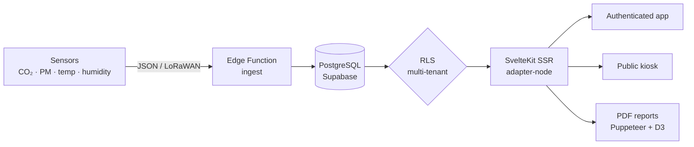
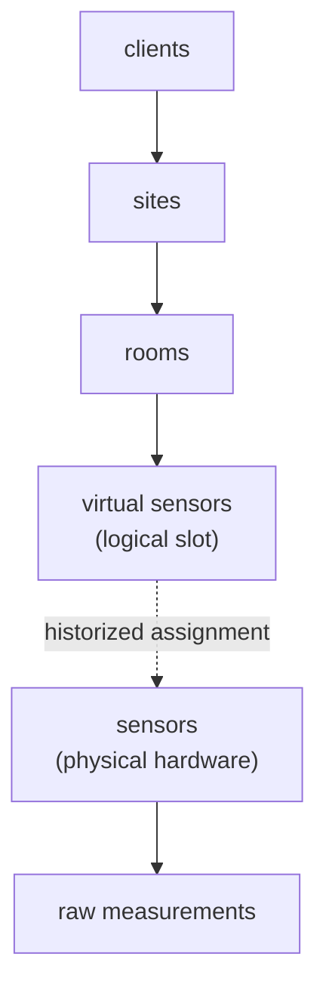
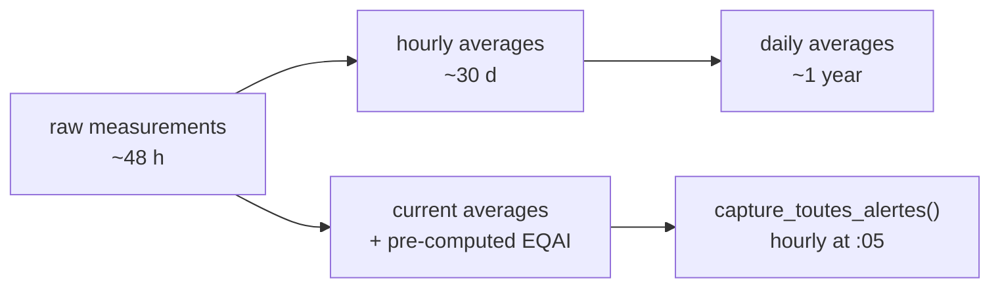
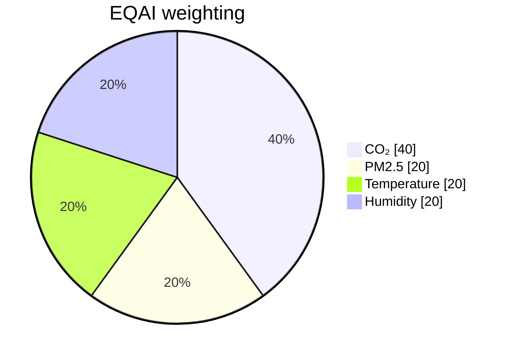

# SensiAir: from the LoRaWAN sensor to the regulatory PDF

I built SensiAir because most "air quality" tools I came across stopped at a green gauge and a CO₂ graph. I wanted to go all the way down the chain: from the physical sensor placed in a classroom to the PDF report a principal can present to an inspector. A multi-tenant SaaS platform, with a kiosk mode for the lobby and an admin console that monitors its own health. Here's how it's put together under the hood, and why I made these choices.

*The dashboard on open: all of a client's sites geolocated, their air index at a glance, and the fleet status (here 100% of sensors online).*

## the problem: indoor air, and the paperwork that comes with it

We spend about 90% of our time indoors, and the air we breathe there is often more loaded than the street's: CO₂ climbing in a poorly ventilated room, fine particles, volatile organic compounds. In France, this is no longer just a comfort matter. Establishments open to the public (schools, daycares, middle schools) have a monitoring obligation, with an annual assessment of ventilation means overseen by the Cerema.

Measuring is one thing. Proving it to an inspector is another. That's the point I wanted to handle end to end: not stopping at the data, but producing the document that makes it enforceable.

*The regulatory framework is built into the app, including Decree No. 2022-1689 (the 2023 IAQ Decree) and the Cerema module. The user doesn't have to go look up the law elsewhere.*

## the product tour in five minutes

On the user side, the authenticated app revolves around a few dense pages:

- **Map dashboard.** All of a client's sites on a map, color-coded by air index, side panel on click, KPIs (average index, uptime, 7-day trend, active alerts). I lazy-loaded the Mapbox map (~1.6 MB) so it wouldn't weigh down the first render.
- **Sites and rooms.** Detailed inventory, with a comparison of indoor air against outdoor weather conditions when I know the site's coordinates.
- **Analytics.** Comparison of three rooms in parallel, hourly heatmaps, distributions, score radar, min/max/mean/standard-deviation stats. The deep-analysis tab is lazy-loaded too.
- **Alerts.** Four distinct types (threshold exceedance, sensor offline, sensor in error, empty location), two severity levels, history with duration and resolution notes, fine filtering and CSV export.
- **Public kiosk.** A login-free route, built for a lobby screen: animated index gauge, building illustration colored room by room, refresh every 30 seconds.
- **Cerema / public buildings.** A full module of its own: campaigns by establishment type, regulatory questionnaire, self-diagnosis backed by sensor data, action plan, signed validation and a public sharing link for the report.
- **Reports.** PDF generation (standard or detailed), with optional AI-written analysis, and a CSV export by room, site or sensor.

And behind it, a super-admin console that's no gadget: monitoring of ingestion requests, database and CRON-job health, audit log, tracking of external-API consumption and per-client quotas.

*Overview of the 6 monitored sites: EQAI index, number of rooms and sensors, coverage rate and mini-trend, site by site.*

*At the site level, each room has its score, and I confront indoor air with outdoor conditions (here 19 against 21).*

*The alert center: 0 critical, tracking of exceedances over 7 days and average resolution time. Enough to steer, not just observe.*

*Kiosk mode: a login-free welcome screen, index gauge and building colored room by room, refreshed every 30 seconds. Built for a school or office lobby.*

## the stack: recent, and owned

I didn't do things by halves on the tooling. The project runs on **SvelteKit 2.47 with Svelte 5.41**, runes included (`$state`, `$derived`, `$props`, `$effect`), served SSR via the Node adapter, built with Vite 7. The UI relies on **Tailwind CSS 4** and a homemade component library based on bits-ui (shadcn-svelte style), with lucide for icons.

The data lives in **Supabase** (PostgreSQL + Auth + Row Level Security), accessed via `@supabase/supabase-js` and `@supabase/ssr`. I regenerate the TypeScript types from the database's real schema, which spares me drift between the SQL and the frontend. Charts are rendered client-side with LayerChart (a D3 wrapper for Svelte) and server-side directly with D3 for the PDFs. i18n goes through **Paraglide**: compiled at build time, zero runtime overhead, FR and EN. Sentry watches errors, Zod validates inputs.

The processing order of requests matters to me. My `hooks.server.ts` chains five stages: Sentry, Supabase session init, authentication check and role-based redirect, security headers (HSTS, CSP, X-Frame-Options), then cache headers differentiated by route (the kiosk can be cached longer than the dashboard). Classic middleware, but explicit and ordered.

To give a sense of the mass: roughly 130,000 lines in `src/`, 264 Svelte components, 62 routes, 42 SQL migrations, 20 tables and 5 views. This isn't a weekend prototype.

## the data model: isolated by design

Everything is arranged in a strict hierarchy, and all isolation between clients rests on PostgreSQL's Row Level Security. A user sees only the data of their `client_id`, without my writing a single `WHERE` clause by hand in the queries: the database filters. Super-admins switch from one client to another via a URL parameter, and use a `service_role` client for admin views that must cross the tenant boundary.

The decision I'm proudest of hides in this diagram: the split between **virtual sensor** and **physical sensor**. The virtual sensor is a logical slot, stable over time, attached to a room. The physical sensor is hardware that fails, gets replaced, gets recalibrated. By historizing the assignments between the two, I can swap a faulty unit without breaking the continuity of the measurement series or losing the room's history. That's exactly the kind of choice that comes from my original trade: in the field, hardware moves, and the data model has to absorb it.

*Each logical slot keeps its history even when the hardware changes (the "Automatic migration" column). It's the virtual/physical decoupling in practice.*

## ingestion and the pipeline: from raw to pre-computed

The sensors send their measurements to a Supabase Edge Function (`/functions/v1/ingest`), which accepts two formats: my native SensiAir format and The Things Stack's for LoRaWAN. Authentication is by API key (prefix `sak_`), with rate limiting and fine-grained logging of each request (`api_ingest_logs`: device, status code, error category, latency). It's this table that feeds the entire ingestion-monitoring page on the admin side.

Rather than running `GROUP BY` over millions of raw rows on every display, I pre-aggregate in successive stages, with PostgreSQL CRON jobs:

Practical consequence: the index, its label and its color are already computed and stored by the time the user opens a page. The read is O(1). Retention decreases with granularity (raw a few days, hourly a month, daily a year), which keeps the database light without losing the long trend.

*Hourly CO₂ evolution with the mediocre / bad thresholds, and the hour-by-hour heatmap. Everything is pre-aggregated, so the display is instant.*

## the EQAI: a composite index, and inverted

At the center, the **EQAI** (European Quality Air Index), rated 0 to 100, with a convention that surprises at first: **lower is better**. 0 is excellent, 100 is bad, the opposite of EPA-type indices. I adjusted all the display logic accordingly, across five color tiers (green, blue, yellow, orange, red).

It's composite, computed by a PostgreSQL function from four weighted metrics:

I gave CO₂ the heaviest weight because my main target is the ventilation of occupied rooms. Alerts rely on thresholds stored as JSONB per client (`seuils_clients`), with pre-configured reusable reference sets. When thresholds are modified, I call the capture function immediately for an instant recompute, rather than waiting for the hourly pass.

*Comparative analysis: synthetic EQAI score and breakdown per metric (CO₂, temperature, humidity, PM2.5, VOC), up to three rooms in parallel.*

*To go further: correlation between two metrics with regression (here CO₂ / temperature, R² = 0.60). We go beyond the simple trend graph.*

## the reports: where it gets serious

Generating a proper PDF server-side, in a serverless environment, isn't trivial, and it's the part that cost me the most. I assembled a complete chain: D3 produces SVGs (curves, heatmaps, gauges, compliance radars), a headless DOM renders them, Puppeteer with a slimmed-down Chromium (`@sparticuz/chromium`) captures, and pdf-lib assembles the final document. Automatic environment detection (Vercel, Lambda) to switch to serverless mode.

The content ranges from the executive summary to the fleet inventory, by way of per-site results and the indoor/outdoor comparison. Optionally, an AI provider (configurable, with a `mock` fallback if no key is supplied) writes analyses and recommendations. And for public buildings, the Cerema report follows the regulatory framework (Decree No. 2022-1689, known as the 2023 IAQ Decree), with signed validation and a public sharing link.

*The deliverable: a server-side generated PDF report (D3 charts, written analysis), ready to archive or present at an inspection. This is what turns measurement into proof.*

*The export: raw measurements, indices, sensor status or alerts, by site, room or sensor, at the desired granularity. The data stays the client's.*

It's this part that turns a pretty dashboard into a tool someone pays to use: it doesn't just show that the air is good, it manufactures the proof to archive.

## what I take away

What matters to me in SensiAir isn't an isolated technology, it's the coherence of having owned the whole chain. The virtual/physical sensor decoupling anticipates the real life of the hardware, because I come from electronics and I know that a sensor gives out. Pre-computing the aggregates treats performance as a schema decision, not a late patch. And the Cerema module anchors the whole thing in a concrete, paying need rather than in a demo.

What's next is already in the code: push and SMS notifications, 2FA, automated email reports. The story isn't over.
