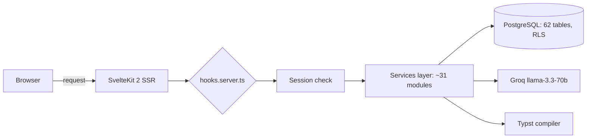
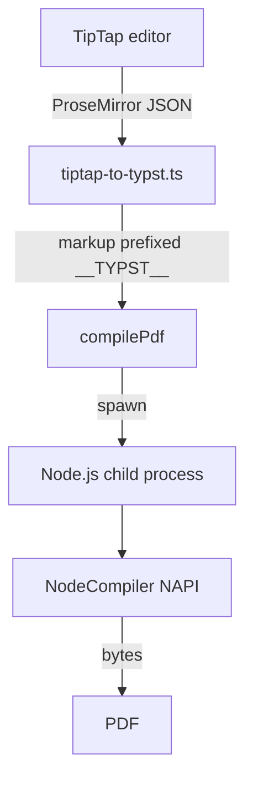

# Tempo: a team-productivity SaaS, shaped by an engineer

> Tempo brings tasks, projects, meetings and documents together in a single SvelteKit app. Under the hood: Supabase and its 62 tables, a homemade Typst PDF generator, and Groq AI bounded by quotas. A guided tour of a solo project that smells of the engineer's workshop.

There are two families of productivity tools. The ones that pile up features until they become unreadable, and the ones that do too little to deserve leaving your spreadsheet. Tempo looks for the ridge line between the two, and the interesting part isn't the marketing promise: it's how it's built. This is a SaaS carried by a single developer, with an engineer's discipline on every layer. Current production version: 0.36.1.

## the pitch

The starting observation is mundane, and that's exactly what makes it credible: a team juggles a task manager, a meeting-notes tool, a drive for documents, and a separate editor whenever a clean PDF is needed. Tempo brings all of this into a single interface, organized around multi-tenant workspaces.

Concretely, a user opens Tempo and finds their dashboard, their tasks in five view formats (list, kanban, calendar, timeline, history), their projects with health indicators, their meetings, and a documents module that ranges from a structured minutes report to a CV exported as PDF. All of it under a theme they chose themselves, persistent across every device.

The business model is set: a free Standard plan after a 14-day trial, a Pro plan at €19 a month (€190 a year), and Enterprise on quote with a per-workspace distributed-license system.

## the grand tour

The core modules don't reinvent the wheel, they mount it well.

**Tasks** support subtasks, priorities, deadlines, colored tags and effort estimation. Estimation is done in half-days (one half-day = 4 h), a granularity choice that fits the reality of a team schedule far better than fictitious hours. That unit feeds everything else: the dashboard computes a workload forecast over the next five business days by spreading each task across its created_at → deadline window, and shifts the load of overdue tasks onto today. No artificial urgency spike, a real smoothed curve.

**Meetings** don't just store notes: each item is typed (note, decision, action, blocker, bug, idea), and an "action" item converts to a task in one click. **Documents** cover a broad spectrum thanks to a section system (text, checklist, code, table, inventory, auto-computed summary) with drag-and-drop reordering. The **CV and letters** module reuses that infrastructure: a dual-panel editor with live PDF preview, four templates, adjustable fonts and sizes.

Above it all, an **admin panel** reserved for the super-admin aggregates MRR, daily active users, plan distribution, and a complete audit log of sensitive actions.

## under the hood

This is where the project starts speaking to a developer. The stack is recent without being unstable: Svelte 5 with runes (`$state`, `$derived`, `$props`), SvelteKit 2, Tailwind CSS v4, shadcn-svelte on top of bits-ui, Zod validation, all in strict TypeScript. The backend rests entirely on Supabase: PostgreSQL, auth, storage and realtime.

The database has 62 tables and 89 versioned SQL migrations, each one protected by Row Level Security: isolation between workspaces isn't checked by fragile application code, it's guaranteed at the database level via `auth.uid()` and `espace_id`. The business logic lives in some thirty pure-function services, which take the Supabase client as their first parameter and always return the same shape `{ success, data?, error? }`. Order of magnitude of the codebase: around 344 Svelte components and 186 TypeScript files.

Authentication goes through a short, readable middleware chain:

## the homemade signature: PDF with Typst

Most SaaS generate their PDFs with Puppeteer (so a headless Chromium to feed) or with a JavaScript lib with poor typography. Tempo made another bet: Typst, the modern typesetting engine heir to the TeX spirit, called via `@myriaddreamin/typst-ts-node-compiler`. Twenty-one `.typ` templates cover CVs, letters, memos, minutes, certificates and procedures.

The detail that separates the tinkerer from the engineer is this: the NAPI compiler crashes under Vite SSR on accented paths (the "os error 123" error on Windows). Rather than bend the Vite config, the compiler is isolated in a Node.js child process that loads the NAPI in CommonJS, outside transpilation, with a workspace in `os.tmpdir()` to escape accents. Thirty lines of owned workaround, instead of a bug that resurfaces on every build.

The bridge between the editor and Typst is worth a word too. The rich text typed in TipTap arrives as ProseMirror JSON, converted to Typst markup by `tiptap-to-typst.ts`. The result is prefixed with a `__TYPST__` marker: that's the signal telling the template to call `eval()` in markup mode rather than treating the content as a raw string. Metadata stays as flexible JSON on the Node side, Typst does the typographic rendering. Clean.

## AI, but bounded

Tempo's AI isn't a chatbot stuck in a corner. Six targeted endpoints rely on Groq and its llama-3.3-70b model: text rewriting, spell-checking, task extraction from a natural-language description (with subtask detection), weekly summary for the dashboard. Each use is useful at a precise spot in the product.

Above all, it's bounded. A quota service counts the day's calls and compares them to the plan: 5 a day on free, 50 on Pro, unlimited on Enterprise. Each call emits a `platform_event`, which gives a free usage audit and feeds the admin stats. Quota overruns are themselves logged. A `GROQ_DEV_MODE` variable unlocks everything in development. That's how you integrate AI when you have to pay the bill.

## the details that give away the engineer

A few choices say a lot about the project's rigor. The theme system offers five bases (Slate, Gray, Sand, Ocean, Mauve) and nine accents in OKLCH colors, with an anti-FOUC inline script in `app.html` that reads cookies before the first render: no default-theme flash on load. The kanban board groups its tasks via a `$derived.by`, with no manual subscription. Tests run on two Vitest environments, Node by default and a real Chromium via Playwright for `.svelte.test.ts` files. And the project ships its GDPR endpoints (export and deferred deletion at 30 days), not as an option bolted on later but as a route in its own right.

## from code to production

No overpriced managed hosting here. Tempo deploys on an Ubuntu VPS behind Nginx, served by `adapter-node` and supervised by PM2, SSL via Let's Encrypt. The pipeline is held together by GitHub Actions: a push to `main` triggers an SSH to the server, `git pull`, `npm ci`, build, then PM2 restart. About three minutes from commit to live.

What strikes you, in the end, is the coherence. Every layer was chosen for a defensible reason, and the trade-offs are owned instead of swept under the rug. Tempo isn't a project trying to impress with its feature list: it's a project that stands up because someone thought about every joint. And that, for a solo product in production, is rare.
