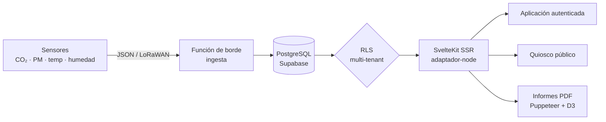
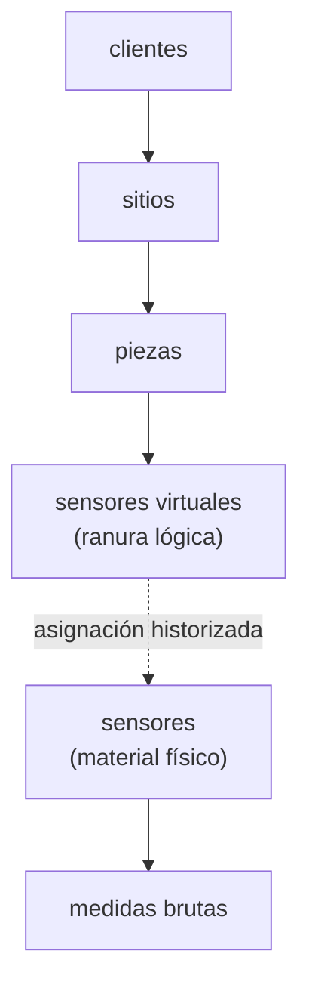
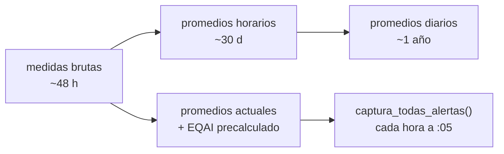
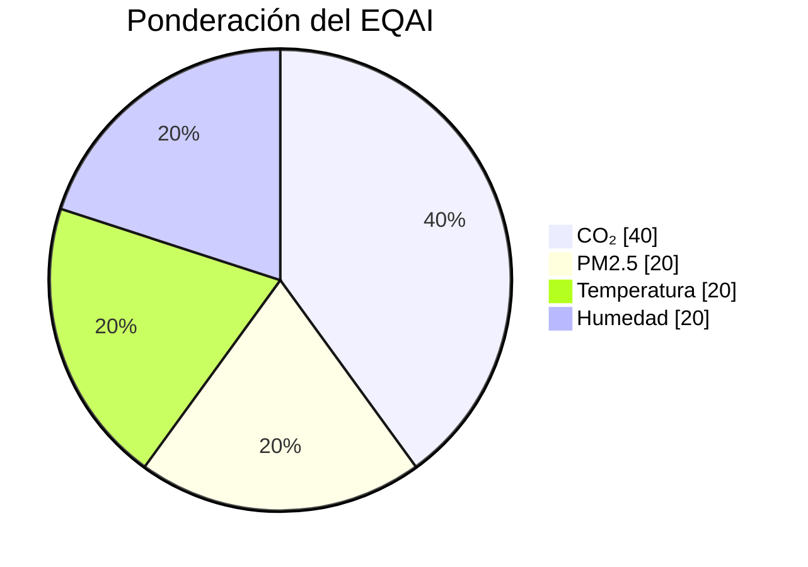

# SensiAir: del sensor LoRaWAN al PDF regulador

Construí SensiAir porque la mayoría de las herramientas de "calidad del aire" que encontraba se limitaban a una medición verde y un gráfico de CO₂. Quería ir hasta el final de la cadena: desde el sensor físico colocado en un aula hasta el informe PDF que un director puede presentar a un inspector. Una plataforma SaaS multi-tenant, con un modo de quiosco para el vestíbulo y una consola de administración que supervisa su propia salud. Aquí está cómo funciona bajo el capó y por qué hice estas elecciones.

*El panel de control al abrir: todos los sitios de un cliente geolocalizados, su índice de aire en un vistazo y el estado del parque (aquí 100% de los sensores en línea).*

## El problema: el aire interior y el administrativo que conlleva

Pasamos aproximadamente el 90% de nuestro tiempo en interiores, y el aire que respiramos allí a menudo está más contaminado que el de la calle: CO₂ que aumenta en un aula mal ventilada, partículas finas, compuestos orgánicos volátiles. En Francia, ya no es solo una cuestión de comodidad. Los establecimientos que reciben al público (escuelas, guarderías, colegios) tienen la obligación de supervisar, con una evaluación anual de los medios de ventilación regulada por el Cerema.

Medir es una cosa. Demostrarlo a un inspector es otra. Este es el punto que quería tratar de principio a fin: no detenerme en los datos, sino producir el documento que los hace oponibles.

*El marco regulatorio está integrado en la aplicación, incluyendo el Decreto n°2022-1689 (Decreto QAI 2023) y el módulo Cerema. El usuario no necesita buscar la ley en otro lugar.*

## El recorrido del producto en cinco minutos

En el lado del usuario, la aplicación autenticada gira alrededor de algunas páginas densas:

- **Panel de control cartográfico**. Todos los sitios de un cliente en un mapa, código de colores según el índice de aire, panel lateral al hacer clic, KPI (índice promedio, tiempo de actividad, tendencia de 7 días, alertas activas). Puse el mapa Mapbox (~1,6 Mo) en carga diferida para no ralentizar la primera visualización.
- **Sitios y piezas**. Inventario detallado, con comparación del aire interior con las condiciones meteorológicas exteriores cuando conozco las coordenadas del sitio.
- **Análisis**. Comparación de tres piezas en paralelo, mapas de calor horarios, distribuciones, radar de puntuaciones, estadísticas mínimas/máximas/promedio/desviación estándar. La pestaña de análisis detallado también se carga de forma diferida.
- **Alertas**. Cuatro tipos distintos (superación de umbral, sensor fuera de línea, sensor en error, ubicación vacía), dos niveles de gravedad, historial con duración y notas de resolución, filtrado fino y exportación CSV.
- **Quiosco público**. Una ruta sin autenticación, pensada para una pantalla de bienvenida: medidor animado del índice, ilustración del edificio coloreado pieza por pieza, actualización cada 30 segundos.
- **Cerema / ERP**. Un módulo independiente: campañas por tipo de establecimiento, cuestionario regulatorio, autodiagnóstico basado en los datos de los sensores, plan de acciones, validación firmada y enlace de compartir el informe público.
- **Informes**. Generación de PDF (estándar o detallado), con la opción de un análisis redactado por IA, y una exportación CSV por pieza, sitio o sensor.

Y detrás, una consola super-administradora que no es un gadget: supervisión de las solicitudes de ingesta, salud de la base y trabajos CRON, registro de auditoría, seguimiento del consumo de API externas y cuotas por cliente.

*Vista general de los 6 sitios supervisados: índice EQAI, número de piezas y sensores, tasa de cobertura y tendencia, sitio por sitio.*

*En el nivel de un sitio, cada pieza tiene su puntuación, y confronto el aire interior con las condiciones exteriores (aquí 19 contra 21).*

*El centro de alertas: 0 críticas, seguimiento de superaciones en 7 días y duración promedio de resolución. Para pilotar, no solo constatar.*

*El modo quiosco: una pantalla de bienvenida sin inicio de sesión, medidor de índice y edificio coloreado pieza por pieza, actualizado cada 30 segundos. Pensado para el vestíbulo de una escuela o oficina.*

## La pila: reciente y asumida

No hice las cosas a medias con las herramientas. El proyecto está en **SvelteKit 2.47 con Svelte 5.41**, incluyendo runes (`$state`, `$derived`, `$props`, `$effect`), servido en SSR a través del adaptador Node, compilado con Vite 7. La interfaz de usuario se basa en **Tailwind CSS 4** y una biblioteca de componentes personalizados basada en bits-ui (similar a shadcn-svelte), con lucide para los iconos.

Los datos viven en **Supabase** (PostgreSQL + Autenticación + Seguridad de nivel de fila), accedidos a través de `@supabase/supabase-js` y `@supabase/ssr`. Regenero los tipos TypeScript desde el esquema real de la base, lo que me evita la derivación entre el SQL y el frontend. Los gráficos se representan en el lado del cliente con LayerChart (un wrapper D3 para Svelte) y en el lado del servidor directamente con D3 para los PDF. La internacionalización pasa por **Paraglide**: compilada en la compilación, sin sobrecoste en tiempo de ejecución, FR y EN. Sentry supervisa los errores, Zod valida las entradas.

El orden de procesamiento de las solicitudes es importante para mí. Mi `hooks.server.ts` encadena cinco etapas: Sentry, inicialización de la sesión Supabase, control de autenticación y redirección según el rol, encabezados de seguridad (HSTS, CSP, X-Frame-Options), y luego encabezados de caché diferenciados por ruta (el quiosco se puede cachear durante más tiempo que el panel de control). Middleware clásico, pero explícito y ordenado.

Para dar una idea de la magnitud: aproximadamente 130 000 líneas en `src/`, 264 componentes Svelte, 62 rutas, 42 migraciones SQL, 20 tablas y 5 vistas. No es un prototipo de fin de semana.

## El modelo de datos: aislado por diseño

Todo está organizado en una jerarquía estricta, y toda la separación entre clientes se basa en la Seguridad de nivel de fila de PostgreSQL. Un usuario solo ve los datos de su `client_id`, sin que yo escriba una sola cláusula `WHERE` a mano en las consultas: la base de datos filtra. Los super-administradores cambian de un cliente a otro a través de un parámetro de URL, y utilizan un cliente `service_role` para las vistas de administración que deben atravesar la frontera de los inquilinos.

La decisión de la que estoy más satisfecho se esconde en este diagrama: la separación entre **sensor virtual** y **sensor físico**. El sensor virtual es una ubicación lógica, estable en el tiempo, vinculada a una pieza. El sensor físico, por otro lado, es material que falla, se reemplaza, se recalibra. Al historizar las asignaciones entre los dos, puedo cambiar un dispositivo defectuoso sin romper la continuidad de las series de medidas ni perder el historial de la pieza. Es típicamente el tipo de elección que viene de mi trabajo original: en el campo, el material se mueve, y el modelo de datos debe absorberlo.

*Cada ubicación lógica mantiene su historial incluso cuando el material cambia (columna «Migración automática»). Es la desconexión virtual/física en práctica.*

## La ingesta y el pipeline: del bruto al precalculado

Los sensores envían sus medidas a una Función de borde Supabase (`/functions/v1/ingesta`), que acepta dos formatos: mi formato nativo SensiAir y el de The Things Stack para LoRaWAN. La autenticación se realiza mediante clave API (prefijo `sak_`), con limitación de velocidad y registro detallado de cada solicitud (`api_ingest_logs`: dispositivo, código de estado, categoría de error, latencia). Es esta tabla la que alimenta toda la página de supervisión de ingesta en el lado administrativo.

En lugar de hacer `GROUP BY` en millones de líneas brutas en cada visualización, prefiero preagregar por etapas sucesivas, con trabajos CRON de PostgreSQL:

Consecuencia práctica: el índice, su etiqueta y su color ya están calculados y almacenados cuando el usuario abre una página. La lectura es en O(1). La retención disminuye con la granularidad (bruto unos días, horario un mes, diario un año), lo que mantiene la base ligera sin perder la tendencia a largo plazo.

*La evolución horaria del CO₂ con los umbrales mediocres/malos, y el mapa de calor hora por hora. Todo está preagregado, por lo que la visualización es instantánea.*

## El EQAI: un índice compuesto y revertido

En el centro, el **EQAI** (Índice de Calidad del Aire Europeo), calificado de 0 a 100, con una convención que sorprende al principio: **más bajo es mejor**. 0 es excelente, 100 es malo, lo opuesto a los índices tipo EPA. Ajusté toda la lógica de visualización en consecuencia, en cinco niveles de color (verde, azul, amarillo, naranja, rojo).

Es compuesto, calculado por una función PostgreSQL a partir de cuatro métricas ponderadas:

Puse el CO₂ con el peso más alto porque mi objetivo principal es la ventilación de las salas ocupadas. Las alertas se basan en umbrales almacenados en JSONB por cliente (`seuils_clients`), con referencias preconfiguradas reutilizables. Cuando se modifican los umbrales, llamo a la función de captura inmediatamente para un recálculo instantáneo, en lugar de esperar el paso horario.

*El análisis comparativo: puntuación EQAI sintética y descomposición por métrica (CO₂, temperatura, humedad, PM2.5, COV), hasta tres piezas en paralelo.*

*Para ir más lejos: correlación entre dos métricas con regresión (aquí CO₂/temperatura, R² = 0,60). Se supera el simple gráfico de tendencia.*

## Los informes: donde se vuelve serio

Generar un PDF correcto en el lado del servidor, en un entorno serverless, no es trivial, y es la parte que me costó más. Armé una cadena completa: D3 produce SVG (curvas, mapas de calor, medidores, radar de conformidad), un DOM headless los representa, Puppeteer con un Chromium ligero (`@sparticuz/chromium`) captura, y pdf-lib ensambla el documento final. Detección automática del entorno (Vercel, Lambda) para cambiar a modo serverless.

El contenido va desde el resumen ejecutivo hasta el inventario del parque, pasando por los resultados por sitio y la comparación interior/exterior. Opcionalmente, un proveedor de IA (configurable, con un respaldo `mock` si no se proporciona ninguna clave) redacta análisis y recomendaciones. Y para los ERP, el informe Cerema sigue el marco regulatorio (Decreto n°2022-1689, llamado Decreto QAI 2023), con validación firmada y enlace de compartir público.

*El entregable: un informe PDF generado en el lado del servidor (gráficos D3, análisis redactado), listo para archivar o presentar en control. Es lo que transforma la medición en prueba.*

*La exportación: medidas brutas, índices, estado de sensores o alertas, por sitio, pieza o sensor, con la granularidad deseada. Los datos siguen siendo del cliente.*

Es esta parte la que transforma un panel de control atractivo en una herramienta que alguien paga para usar: no solo muestra que el aire es bueno, sino que crea la prueba para archivar.

## Lo que retengo

Lo que cuenta para mí en SensiAir no es una tecnología aislada, es la coherencia de haber asumido toda la cadena. La desconexión entre sensor virtual y físico anticipa la vida real del material, porque vengo de la electrónica y sé que un sensor falla. El pre-cálculo de los agregados trata el rendimiento como una decisión de esquema, no como un parche tardío. Y el módulo Cerema ancla todo en una necesidad concreta y rentable, en lugar de en una demostración.

La continuación ya está en el código: notificaciones push y SMS, autenticación de dos factores, informes de correo electrónico automatizados. La historia no ha terminado.
