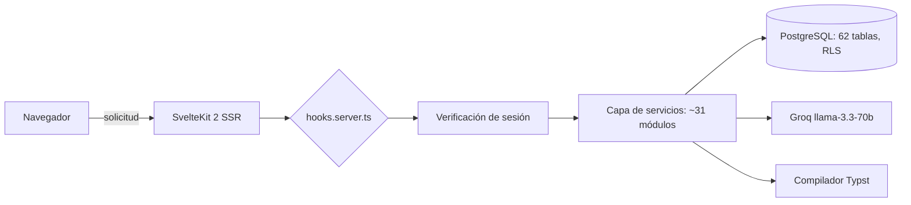
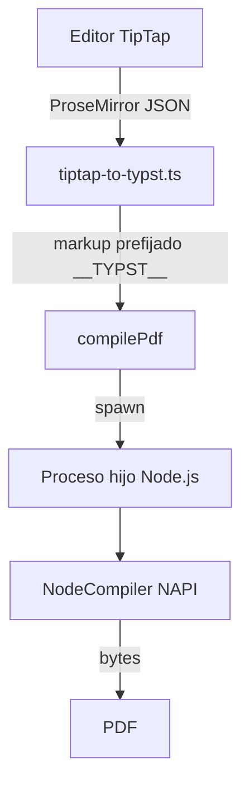

# Tempo: un SaaS de productividad de equipo, creado por un ingeniero

> Tempo reúne tareas, proyectos, reuniones y documentos en una sola aplicación SvelteKit. Bajo el capó: Supabase y sus 62 tablas, un generador de PDF Typst casero, y IA Groq enmarcada por cuotas. Visita guiada de un proyecto solo que huele a taller de ingeniero.

Hay dos familias de herramientas de productividad. Aquellas que apilan funcionalidades hasta volverse ilegibles, y aquellas que hacen demasiado poco para merecer que se abandone su tableur. Tempo busca la línea de crête entre las dos, y lo más interesante no es la promesa de marketing: es la manera en que está construido. Estamos ante un SaaS llevado por un solo desarrollador, con una disciplina de ingeniero en cada capa. Versión actual en producción: 0.36.1.

## El pitch

La constatación de partida es banal, y es precisamente eso lo que la hace creíble: un equipo se las arregla entre un gestor de tareas, una herramienta de notas de reunión, un drive para los documentos, y un editor separado cada vez que hay que sacar un PDF decente. Tempo reúne todo eso en una interfaz única, organizada alrededor de espacios de trabajo multi-inquilinos.

Concretamente, un usuario abre Tempo y encuentra su panel de control, sus tareas en cinco formas de vista (lista, kanban, calendario, línea de tiempo, historial), sus proyectos con indicadores de salud, sus reuniones, y un módulo de documentos que va desde el informe estructurado hasta el CV exportado en PDF. Todo bajo un tema que él mismo ha elegido, persistente en todos sus dispositivos.

El modelo económico está establecido: un plan Estándar gratuito después de 14 días de prueba, un plan Pro a 19 € por mes (190 € al año), y Enterprise con presupuesto con un sistema de licencias distribuidas por espacio.

## El recorrido del propietario

Los módulos centrales no reinventan la rueda, la montan bien.

Las **tareas** aceptan subtareas, prioridades, plazos, etiquetas coloreadas y estimación de carga. La estimación se hace en medias jornadas (una media jornada = 4 h), una elección de granularidad que se ajusta al realidad de una planificación de equipo mucho mejor que las horas ficticias. Esta unidad irriga todo lo demás: el panel de control calcula una previsión de carga sobre los cinco próximos días laborables repartiendo cada tarea en su ventana created_at → plazo, y cambia la carga de las tareas atrasadas a hoy. No hay pico de urgencia artificial, una curva suavizada real.

Las **reuniones** no almacenan solo notas: cada elemento es tipado (nota, decisión, acción, bloqueador, error, idea), y un elemento "acción" se convierte en tarea con un solo clic. Los **documentos** cubren un amplio espectro gracias a un sistema de secciones (texto, lista de verificación, código, tabla, inventario, balance auto-calculado) con reorganización por arrastre y soltar. El módulo **CV y cartas** reutiliza esta infraestructura: editor en doble panel con vista previa de PDF en vivo, cuatro plantillas, fuentes y tamaño ajustables.

Encima, un **panel de administración** reservado al super-administrador agrega MRR, usuarios activos diarios, distribución de planes, y un registro de auditoría completo de acciones sensibles.

## Bajo el capó

Aquí es donde el proyecto se vuelve interesante para un desarrollador. La pila es reciente sin ser inestable: Svelte 5 con las runas (`$state`, `$derived`, `$props`), SvelteKit 2, Tailwind CSS v4, shadcn-svelte sobre bits-ui, validación Zod, todo en TypeScript estricto. El backend se basa enteramente en Supabase: PostgreSQL, autenticación, almacenamiento y tiempo real.

La base cuenta con 62 tablas y 89 migraciones SQL versionadas, cada una protegida por Row Level Security: la isolación entre espacios no se verifica mediante código de aplicación frágil, está garantizada al nivel de la base mediante `auth.uid()` y `espace_id`. La lógica de negocio vive en una treintena de servicios con funciones puras, que toman el cliente Supabase como primer parámetro y devuelven siempre la misma forma `{ éxito, datos?, error? }`. Orden de magnitud del código: alrededor de 344 componentes Svelte y 186 archivos TypeScript.

La autenticación pasa por una cadena de middleware corta y legible:

## La firma casera: PDF con Typst

La mayoría de los SaaS generan sus PDF con Puppeteer (por lo tanto, un Chromium headless para alimentar) o con una librería JavaScript con tipografía pobre. Tempo ha hecho otra apuesta: Typst, el motor de composición moderno heredero del espíritu TeX, llamado a través de `@myriaddreamin/typst-ts-node-compiler`. Veintiún plantillas `.typ` cubren CV, cartas, memorandos, actas, certificados y procedimientos.

El detalle que separa al aficionado del ingeniero es el siguiente: el compilador NAPI se estrella en SSR Vite en los caminos acentuados (el error "os error 123" en Windows). En lugar de torcer la configuración Vite, el compilador se aísla en un proceso hijo Node.js que carga el NAPI en CommonJS, fuera de la transpilación, con un espacio de trabajo en `os.tmpdir()` para escapar de los acentos. Treinta líneas de contorno asumido, en lugar de un error que resurge en cada compilación.

El puente entre el editor y Typst también merece una mención. El texto enriquecido introducido en TipTap llega en JSON ProseMirror, convertido en markup Typst por `tiptap-to-typst.ts`. El resultado está prefijado por un marcador `__TYPST__`: es la señal que dice al plantilla que llame a `eval()` en modo markup en lugar de tratar el contenido como una cadena bruta. Las metadatos permanecen en JSON flexible en el lado del servidor, Typst hace el renderizado tipográfico. Limpio.

## De la IA, pero enmarcada

La IA de Tempo no es un chatbot pegado en un rincón. Seis puntos finales apoyados en Groq y su modelo llama-3.3-70b: reformulación de texto, corrección ortográfica, extracción de tareas desde una descripción en lenguaje natural (con detección de subtareas), resumen semanal para el panel de control. Cada uso es útil en un lugar específico del producto.

Sobre todo, está limitado. Un servicio de cuotas cuenta las llamadas del día y las compara con el plan: 5 por día en gratuito, 50 en Pro, ilimitado en Enterprise. Cada llamada emite un `platform_event`, lo que da una auditoría de uso gratuito y alimenta las estadísticas de administración. El exceso de cuota se registra también. Una variable `GROQ_DEV_MODE` desbloquea todo en desarrollo. Es la manera en que se integra la IA cuando se tiene que pagar la factura.

## Los detalles que delatan al ingeniero

Algunas elecciones dicen mucho sobre la rigidez del proyecto. El sistema de temas propone cinco bases (Slate, Gray, Sand, Ocean, Mauve) y nueve acentos en colores OKLCH, con un script anti-FOUC en línea en `app.html` que lee las cookies antes del primer renderizado: ningún destello de tema por defecto en la carga. La tabla kanban agrupa sus tareas a través de un `$derived.by`, sin suscripción manual. Las pruebas giran en dos entornos Vitest, Node por defecto y un verdadero Chromium a través de Playwright para los archivos `.svelte.test.ts`. Y el proyecto incorpora sus puntos finales RGPD (exportación y supresión diferida a 30 días), no como una opción agregada más tarde, sino como una ruta aparte.

## Del código a la producción

No hay alojamiento administrado de alto precio aquí. Tempo se despliega en un VPS Ubuntu detrás de Nginx, servido por `adapter-node` y supervisado por PM2, SSL a través de Let's Encrypt. La canalización está mantenida por GitHub Actions: un push en `main` desencadena un SSH hacia el servidor, `git pull`, `npm ci`, compilación, y luego reinicio PM2. Alrededor de tres minutos desde el compromiso hasta la publicación.

Lo que llama la atención, al final del día, es la coherencia. Cada capa ha sido elegida por una razón defendible, y los compromisos están asumidos en lugar de estar escondidos bajo la alfombra. Tempo no es un proyecto que busque impresionar con su lista de funcionalidades: es un proyecto que se mantiene en pie porque alguien ha pensado en cada junta. Y eso, para un producto solo en producción, es raro.
