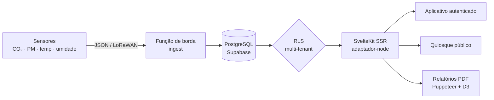
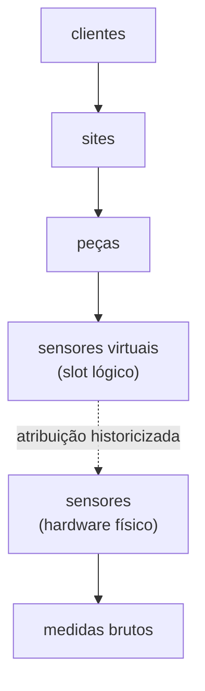
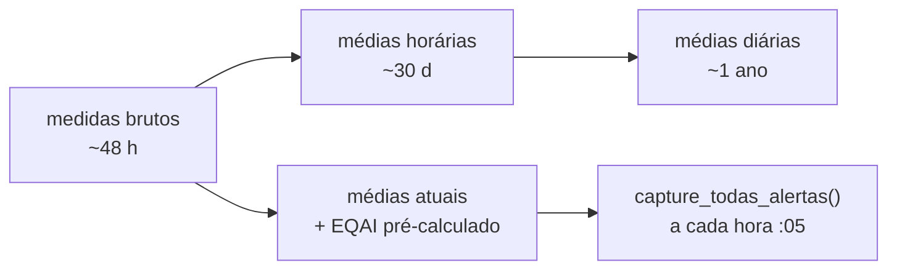
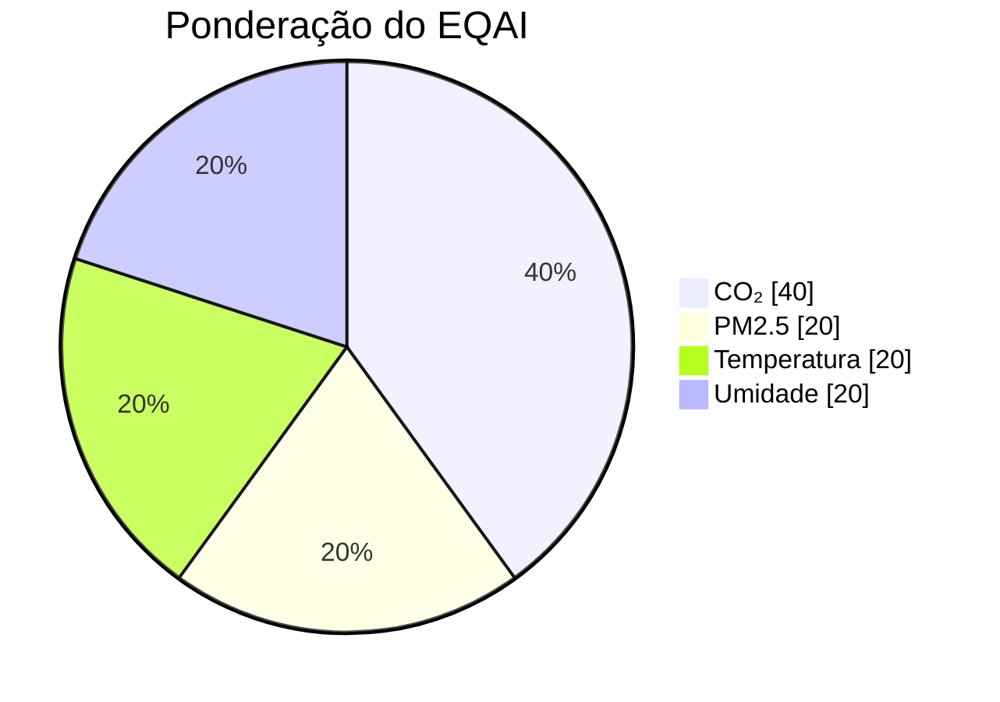

# SensiAir: do sensor LoRaWAN ao PDF regulamentar

Construí o SensiAir porque a maioria das ferramentas de "qualidade do ar" que encontrei paravam em um medidor verde e um gráfico de CO₂. Queria ir até o fim da cadeia: do sensor físico colocado em uma sala de aula até o relatório PDF que um diretor pode apresentar a um inspetor. Uma plataforma SaaS multi-tenant, com um modo de quiosque para o hall de entrada e uma console de admin que monitora sua própria saúde. Aqui está como funciona por baixo dos panos e por que fiz essas escolhas.

*O painel de controle ao abrir: todos os sites de um cliente geolocalizados, seu índice de ar em um olhar, e o estado do parque (aqui 100% dos sensores online).*

## o problema: o ar interior e o administrativo que vem com ele

Passamos cerca de 90% do nosso tempo interiormente, e o ar que respiramos lá é frequentemente mais carregado do que o da rua: CO₂ que aumenta em uma sala mal ventilada, partículas finas, compostos orgânicos voláteis. Na França, não é mais apenas uma questão de confort. Estabelecimentos que recebem o público (escolas, creches, colégios) têm uma obrigação de monitoramento, com uma avaliação anual dos meios de ventilação enquadrada pelo Cerema.

Medir é uma coisa. Provar a um inspetor é outra. É o ponto que eu queria tratar de ponta a ponta: não parar nos dados, mas produzir o documento que os torna oponíveis.

*O quadro regulamentar é integrado ao aplicativo, incluindo o Decreto n°2022-1689 (Decreto QAI 2023) e o módulo Cerema. O usuário não precisa procurar a lei em outro lugar.*

## o tour do produto em cinco minutos

Do lado do usuário, o aplicativo autenticado gira em torno de algumas páginas densas:

- **Painel de controle cartográfico.** Todos os sites de um cliente em um mapa, código de cores de acordo com o índice de ar, painel lateral ao clicar, KPIs (índice médio, tempo de atividade, tendência de 7 dias, alertas ativos). Coloquei o mapa Mapbox (~1,6 Mo) em carregamento diferido para não sobrecarregar o primeiro render.
- **Sites e peças.** Inventário detalhado, com comparação do ar interior em relação às condições meteorológicas externas quando eu conheço as coordenadas do site.
- **Análise.** Comparação de três peças em paralelo, mapas de calor horários, distribuições, radar de pontuações, estatísticas min/max/média/desvio padrão. A guia de análise aprofundada também é carregada diferidamente.
- **Alertas.** Quatro tipos distintos (ultrapassagem de limite, sensor offline, sensor em erro, localização vazia), dois níveis de gravidade, histórico com duração e notas de resolução, filtragem fina e exportação CSV.
- **Quiosque público.** Uma rota sem autenticação, pensada para uma tela de entrada: medidor animado do índice, ilustração do prédio colorida peça por peça, atualização a cada 30 segundos.
- **Cerema / ERP.** Um módulo à parte: campanhas por tipo de estabelecimento, questionário regulamentar, autodiagnóstico apoiado nos dados dos sensores, plano de ações, validação assinada e link de compartilhamento público do relatório.
- **Relatórios.** Geração de PDF (padrão ou detalhado), com opção de análise redigida por IA, e exportação CSV por peça, site ou sensor.

E por trás, uma console super-admin que não é um gadget: monitoramento das requisições de ingestão, saúde da base e dos trabalhos CRON, registro de auditoria, acompanhamento do consumo de APIs externas e dos limites por cliente.

*Visão geral dos 6 sites monitorados: índice EQAI, número de peças e sensores, taxa de cobertura e mini-tendência, site por site.*

*No nível de um site, cada peça tem sua pontuação, e eu comparo o ar interior com as condições externas (aqui 19 contra 21).*

*O centro de alertas: 0 crítico, acompanhamento das ultrapassagens em 7 dias e duração média de resolução. O suficiente para pilotar, não apenas constatar.*

*O modo quiosque: uma tela de entrada sem login, medidor de índice e prédio colorido peça por peça, atualizado a cada 30 segundos. Pensado para o hall de uma escola ou escritório.*

## a pilha: recente e assumida

Não fiz meio-termo nos ferramentais. O projeto está em **SvelteKit 2.47 com Svelte 5.41**, runes incluídas (`$state`, `$derived`, `$props`, `$effect`), servido em SSR via o adaptador Node, compilado com Vite 7. A interface do usuário se baseia em **Tailwind CSS 4** e uma biblioteca de componentes caseira baseada em bits-ui (modo shadcn-svelte), com lucide para os ícones.

Os dados vivem em **Supabase** (PostgreSQL + Auth + Row Level Security), acessados via `@supabase/supabase-js` e `@supabase/ssr`. Regenero os tipos TypeScript a partir do esquema real da base, o que me evita a derivação entre o SQL e o front. Os gráficos são renderizados no lado do cliente com LayerChart (um wrapper D3 para Svelte) e no lado do servidor diretamente com D3 para os PDFs. A i18n passa por **Paraglide**: compilado na compilação, zero de sobrecarga no tempo de execução, FR e EN. Sentry monitora os erros, Zod valida as entradas.

A ordem de processamento das requisições é importante para mim. Meu `hooks.server.ts` encadeia cinco estágios: Sentry, inicialização da sessão Supabase, controle de autenticação e redirecionamento de acordo com o papel, cabeçalhos de segurança (HSTS, CSP, X-Frame-Options), e então cabeçalhos de cache diferenciados por rota (o quiosque pode ser armazenado em cache por mais tempo do que o painel de controle). Middleware clássico, mas explícito e ordenado.

Para dar uma ideia da magnitude: cerca de 130.000 linhas em `src/`, 264 componentes Svelte, 62 rotas, 42 migrações SQL, 20 tabelas e 5 vistas. Não é um protótipo de fim de semana.

## o modelo de dados: isolado por design

Tudo é organizado em uma hierarquia estrita, e toda a isolamento entre clientes se baseia na Row Level Security do PostgreSQL. Um usuário só vê os dados de seu `client_id`, sem que eu escreva uma única cláusula `WHERE` manualmente nas consultas: a base filtra. Os super-admins alternam entre clientes via um parâmetro de URL e usam um cliente `service_role` para as vistas de administração que precisam atravessar a fronteira dos inquilinos.

A decisão da qual estou mais satisfeito se esconde neste diagrama: a separação entre **sensor virtual** e **sensor físico**. O sensor virtual é um local lógico, estável no tempo, vinculado a uma peça. O sensor físico, por outro lado, é hardware que falha, é substituído, recalibrado. Ao historicizar as atribuições entre os dois, posso trocar um dispositivo defeituoso sem quebrar a continuidade das séries de medidas nem perder o histórico da peça. É típico do tipo de escolha que vem do meu trabalho original: no campo, o hardware se move, e o modelo de dados deve absorvê-lo.

*Cada local lógico mantém seu histórico mesmo quando o hardware muda (coluna «Migration automática»). É o desacoplamento virtual/físico na prática.*

## a ingestão e o pipeline: do bruto ao pré-calculado

Os sensores enviam suas medidas a uma Função de borda Supabase (`/functions/v1/ingest`), que aceita dois formatos: meu formato nativo SensiAir e o do The Things Stack para o LoRaWAN. A autenticação é feita por chave API (prefixo `sak_`), com limitação de taxa e registro detalhado de cada requisição (`api_ingest_logs`: dispositivo, código de status, categoria de erro, latência). É essa tabela que alimenta toda a página de monitoramento de ingestão do lado admin.

Em vez de fazer `GROUP BY` em milhões de linhas brutos a cada exibição, pré-agrego por estágios sucessivos, com CRON PostgreSQL:

Consequência prática: o índice, seu rótulo e sua cor já estão calculados e armazenados no momento em que o usuário abre uma página. A leitura é em O(1). A retenção diminui com a granularidade (bruto alguns dias, horário um mês, diário um ano), o que mantém a base leve sem perder a tendência de longo prazo.

*A evolução horária do CO₂ com os limites médio/ruim, e o mapa de calor hora a hora. Tudo é pré-agregado, então a exibição é instantânea.*

## o EQAI: um índice composto e invertido

No centro, o **EQAI** (Índice de Qualidade do Ar Europeu), notado de 0 a 100, com uma convenção que surpreende ao primeiro olhar: **mais baixo é melhor**. 0 é excelente, 100 é ruim, o oposto dos índices do tipo EPA. Ajustei toda a lógica de exibição de acordo, em cinco níveis de cor (verde, azul, amarelo, laranja, vermelho).

É composto, calculado por uma função PostgreSQL a partir de quatro métricas ponderadas:

Coloquei o CO₂ no peso mais pesado porque meu alvo principal é a ventilação das salas ocupadas. As alertas se baseiam em limites armazenados em JSONB por cliente (`seuil_clients`), com referências pré-configuradas reutilizáveis. Quando mudo os limites, chamo a função de captura imediatamente para um recálculo instantâneo, em vez de esperar a passagem horária.

*A análise comparativa: pontuação EQAI sintética e decomposição por métrica (CO₂, temperatura, umidade, PM2.5, COV), até três peças em paralelo.*

*Para ir mais longe: correlação entre duas métricas com regressão (aqui CO₂/temperatura, R² = 0,60). Vamos além do simples gráfico de tendência.*

## os relatórios: onde as coisas ficam sérias

Gerar um PDF correto no lado do servidor, em um ambiente serverless, não é trivial, e é a parte que me custou mais. Monte uma cadeia completa: D3 produz SVGs (curvas, mapas de calor, medidores, radar de conformidade), um DOM headless os renderiza, Puppeteer com um Chromium leve (`@sparticuz/chromium`) captura, e pdf-lib monta o documento final. Detecção automática do ambiente (Vercel, Lambda) para alternar para o modo serverless.

O conteúdo vai da síntese executiva ao inventário do parque, passando pelos resultados por site e comparação interior/exterior. Em opção, um fornecedor de IA (configurável, com um fallback `mock` se nenhuma chave for fornecida) redige análises e recomendações. E para os ERPs, o relatório Cerema segue o quadro regulamentar (Decreto n°2022-1689, dito Decreto QAI 2023), com validação assinada e link de compartilhamento público.

*O resultado: um relatório PDF gerado no lado do servidor (gráficos D3, análise redigida), pronto para arquivar ou apresentar em controle. É o que transforma a medição em prova.*

*A exportação: medidas brutos, índices, estado dos sensores ou alertas, por site, peça ou sensor, com a granularidade desejada. Os dados permanecem do cliente.*

É essa parte que transforma um painel de controle bonito em uma ferramenta que alguém paga para usar: não mostra apenas que o ar é bom, fabrica a prova para arquivar.

## o que retiro

O que importa para mim no SensiAir não é uma tecnologia isolada, é a coerência de ter assumido toda a cadeia. O desacoplamento sensor virtual/físico antecipa a vida real do hardware, porque venho da eletrônica e sei que um sensor falha. O pré-cálculo dos agregados trata o desempenho como uma decisão de esquema, não como um patch tardio. E o módulo Cerema ancora tudo em uma necessidade concreta e paga, em vez de uma demonstração.

A sequência já está no código: notificações push e SMS, 2FA, relatórios de e-mail automatizados. A história não terminou.
