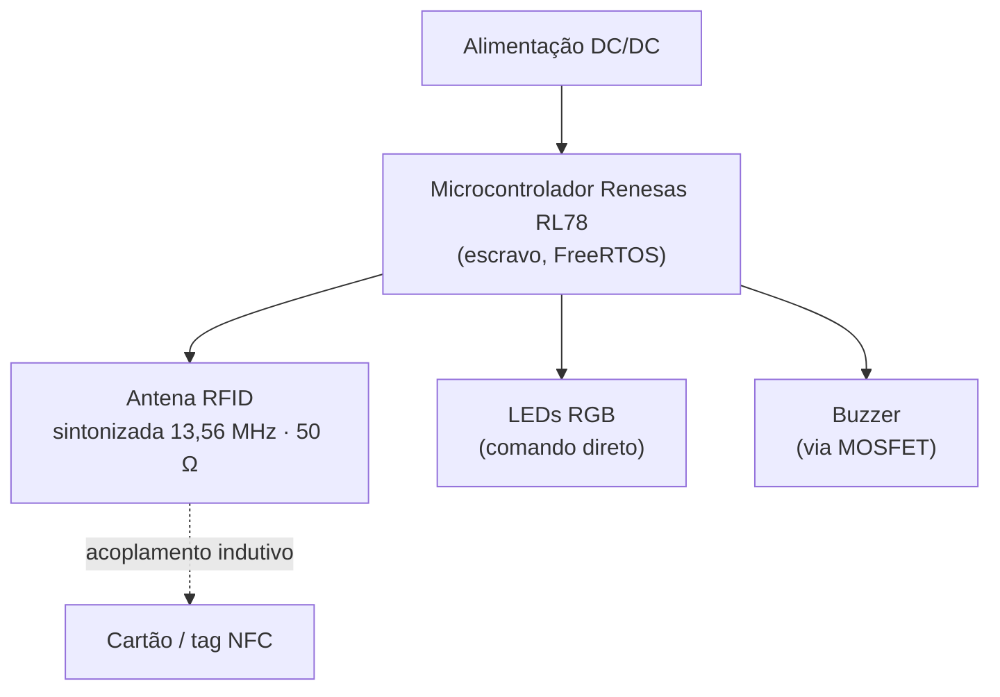
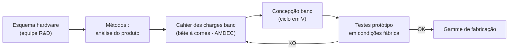

Cheguei na SpringCard com um DUT GEII e seis meses de CDI técnico nas pernas, fazendo suporte em roteamento de PCB. Deixei o local três anos depois, tendo projetado a antena do produto principal da empresa e dirigido o serviço de métodos. Entre esses dois períodos, fiz um aprendizado de engenharia na Polytech Sorbonne e trabalhei em uma PME onde tocamos em tudo porque éramos dezenove pessoas.

É isso que é interessante em uma pequena estrutura: a distância entre "eu entendo o esquema" e "eu tenho meu nome na parte alta do produto em produção" é medida em meses, não em anos.

## O terreno: uma casa francesa de contato sem fio

A SpringCard projeta e fabrica na França acopladores e leitores RFID/NFC de 13,56 MHz, para controle de acesso, transportes e estacionamento. Criada no início dos anos 2000 a partir de uma divisão do escritório de estudos da Noralsy, a marca Springcard foi lançada em 2005, e a SpringCard SAS em 2015. Modelo 100% B2B, com clientes como Thales, Sagem, Aeroporto de Paris — e os 35.000 leitores que equipam as estações Vélib' de Paris.

A organização é simples e clara: hardware em Palaiseau (sob a responsabilidade de Jérôme Chalbot, meu tutor), software em Angers, montagem no parceiro Prod2J. Uma linha hierárquica curta, muita autonomia por serviço. O tipo de lugar onde um aprendiz vê confiados projetos reais porque não há ninguém mais para executá-los.

## Os projetos que me formaram

Antes do Puck, dois produtos Cykleo me serviram de banco de testes em tamanho real.

O **CykleoRail**, no início do aprendizado, é um detector de presença de bicicleta em estação. Sem possibilidade de pesagem devido à heterogeneidade da frota, então detecção por ultrassom: pura eletrônica analógica — filtragem, amplificação baseada em AOP — exatamente o que eu via nas aulas de eletrônica analógica no mesmo momento. E como as estações frequentemente não têm conexão, é onde eu implementei LoRa para o envio de dados, em paralelo com meus cursos de IoT.

O **Biketracker**, ainda para Cykleo, me fez passar para o outro lado: concepção em ciclo em V, mas principalmente dossier de viabilidade, oferta comercial, troca direta com o cliente, sob a supervisão de Johann Dantant. É onde eu entendi que um projeto de hardware é jogado tanto na escolha dos componentes — disponibilidade, obsolescência, preferimos Renesas para a vida útil — quanto no esquema em si.

## O Puck e sua antena

O **Puck** é o leitor de mesa que deveria substituir uma grande parte do portfólio, concentrando a produção em um único produto. Ele se monta em duas partes na fábrica: o CPU Puck e a parte alta — a antena Puck, na qual eu trabalhei.

Essa placa não é apenas um loop. Ela empilha vários ofícios em alguns centímetros quadrados:

Do lado analógico, a antena RFID deve ser sintonizada para responder melhor a 13,56 MHz (ISO 18000-3), com uma rede de adaptação que reduz a impedância da pista para 50 Ω. É uma antena simétrica: o ajuste perfeito no banco vazio não vale nada se ele se desmorona assim que se aproxima uma mão ou um invólucro, então projetamos para o caso real, não para a medição ideal. Ao redor, LEDs RGB e um buzzer pilotados pelo microcontrolador via MOSFET, e uma alimentação DC/DC.

Do lado do firmware, o RL78 roda sob FreeRTOS em modo escravo: ele responde aos comandos do resto do produto. É o tipo de arquitetura que eu refaço hoje em embarcado, e é nessa placa que eu coloquei as bases.

## Responsável por métodos: onde a concepção encontra a fábrica

Em novembro de 2020, o presidente me confiou o serviço de métodos. Mudança de foco: não se projeta mais o produto, garante-se que ele seja fabricado rapidamente, bem e sem problemas. É o ano em que eu vi por que um bom esquema não é suficiente.

Duas correções resumem o espírito do posto, porque elas são invisíveis na simulação e brutais em série.

No módulo OEM **K663** com antena simétrica, os protótipos passavam sem problemas. Na pré-industrialização, em grandes volumes, mais de 37% da produção saía com defeitos de soldagem: um footprint mal dimensionado, que não era visível na unidade, mas explodiu em escala. Redimensionamento do footprint, problema resolvido.

No **Puck**, as duas partes se soldam à mão em sete pontos. Os dois pinos de massa se recusavam a esquentar corretamente: o plano de massa da antena dissipava muito, a soldagem arrastava. Eu modifiquei o espaçamento das massas no gerber para reduzir o tempo de soldagem — portanto, o tempo técnico por produto, portanto o custo dessa etapa.

O resto do posto girava em torno disso: inventário e atualização dos bancos de teste (alguns para produtos descontinuados, outros com vinte anos de funções acumuladas), concepção dos novos bancos em ciclo em V, gestão das nomenclaturas sob Excalibur para absorver a escassez de componentes do Covid sem desviar do cahier des charges ou do preço-alvo, e até o packaging — a história do cabo USB-C de 2m que acabamos por fazer entregar pré-enrolado no diâmetro correto para que o técnico não o desenrole e reenrole a cada caixa.

Finalmente, eu montei o SAV a partir do zero: processo RMA, documentação de reparo pensada para um técnico sem bagagem eletrônica, e formações internas — a "Springcard Academy" — sobre eletrônica geral e soldagem de componentes 0201. A ideia: que cada um saia com uma habilidade real, não apenas mão-de-obra.

## o que eu retiro disso

Três coisas permaneceram. O reflexo DFM: um produto se projeta para ser fabricado, não apenas para funcionar no protótipo. A ideia de que o real sempre tem razão sobre a simulação, aprendida com uma antena desafinada e um plano de massa muito exigente ao mesmo tempo. E a gestão de equipe e de projeto, que me impulsionou a dobrar Polytech com um curso na IAE Paris.

Uma PME de dezenove pessoas não ensina uma especialidade, ensina a cadeia inteira: do AOP ao gerber, do cliente ao técnico de fábrica. Para iniciar uma carreira de engenheiro, é difícil superar.
