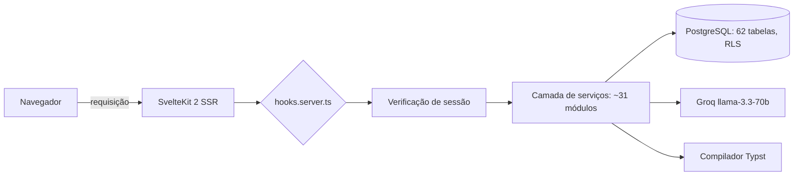
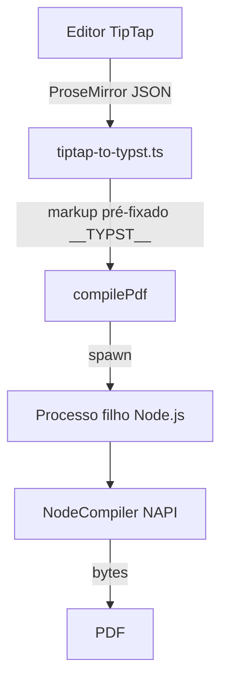

# Tempo: um SaaS de produtividade de equipe, criado por um engenheiro

> Tempo reúne tarefas, projetos, reuniões e documentos em um único aplicativo SvelteKit. Por baixo dos panos: Supabase e suas 62 tabelas, um gerador de PDF Typst caseiro e IA Groq com quotas. Visita guiada a um projeto solo que cheira a oficina de engenheiro.

Existem duas famílias de ferramentas de produtividade. Aquelas que empilham funcionalidades até se tornarem ilegíveis e aquelas que fazem muito pouco para justificar a saída de um planilha. Tempo busca o equilíbrio entre as duas, e o mais interessante não é a promessa de marketing: é a maneira como foi construído. Estamos lidando com um SaaS mantido por um único desenvolvedor, com uma disciplina de engenheiro em cada camada. Versão atual em produção: 0.36.1.

## O pitch

A constatação inicial é banal, e é exatamente isso que a torna crível: uma equipe jongla entre um gerenciador de tarefas, uma ferramenta de notas de reunião, um drive para documentos e um editor separado sempre que é necessário criar um PDF decente. Tempo reúne tudo isso em uma interface única, organizada em torno de espaços de trabalho multi-locatários.

Concretamente, um usuário abre o Tempo e encontra seu painel de controle, suas tarefas em cinco formas de visualização (lista, kanban, calendário, linha do tempo, histórico), seus projetos com indicadores de saúde, suas reuniões e um módulo de documentos que vai desde o relatório estruturado até o currículo exportado em PDF. Tudo isso com um tema personalizado, persistente em todos os dispositivos.

O modelo econômico está estabelecido: um plano Standard gratuito após 14 dias de teste, um plano Pro por 19 € por mês (190 € por ano) e um plano Enterprise personalizado com um sistema de licenças distribuídas por espaço.

## O tour do proprietário

Os módulos principais não reinventam a roda, apenas a montam bem.

As **tarefas** aceitam subtarefas, prioridades, prazos, tags coloridas e estimativa de carga. A estimativa é feita em meias-jornadas (meia-jornada = 4 horas), uma escolha de granularidade que se ajusta melhor ao real de um planejamento de equipe do que horas fictícias. Essa unidade irriga todo o resto: o painel de controle calcula uma previsão de carga nos próximos cinco dias úteis, distribuindo cada tarefa em sua janela created_at → prazo, e alterna a carga das tarefas atrasadas para hoje. Sem pico de urgência artificial, uma curva suavizada real.

As **reuniões** não armazenam apenas notas: cada item é tipado (nota, decisão, ação, bloqueador, bug, ideia) e um item "ação" se converte em tarefa com um clique. Os **documentos** cobrem um espectro amplo graças a um sistema de seções (texto, checklist, código, tabela, inventário, balanço auto-calculado) com reorganização por arrastar e soltar. O módulo **Currículo e cartas** reutiliza essa infraestrutura: editor em painel duplo com visualização de PDF em tempo real, quatro modelos, fontes e tamanho ajustáveis.

Acima, um **painel de administração** reservado ao superadministrador agrega MRR, usuários ativos diários, distribuição de planos e um registro de auditoria completo de ações sensíveis.

## Por baixo dos panos

Aqui é onde o projeto se torna interessante para um desenvolvedor. A pilha é recente, mas não instável: Svelte 5 com as runas (`$state`, `$derived`, `$props`), SvelteKit 2, Tailwind CSS v4, shadcn-svelte sobre bits-ui, validação Zod, tudo em TypeScript estrito. O backend repousa inteiramente sobre o Supabase: PostgreSQL, autenticação, armazenamento e tempo real.

O banco de dados tem 62 tabelas e 89 migrações SQL versionadas, cada uma protegida por Row Level Security: a isolamento entre espaços não é verificada por código aplicativo frágil, é garantida no nível do banco por meio de `auth.uid()` e `espace_id`. A lógica de negócios vive em cerca de trinta serviços com funções puras, que tomam o cliente Supabase como primeiro parâmetro e sempre retornam a mesma forma `{ success, data?, error? }`. Ordem de grandeza do código: cerca de 344 componentes Svelte e 186 arquivos TypeScript.

A autenticação passa por uma cadeia de middleware curta e legível:

## A assinatura caseira: PDF com Typst

A maioria dos SaaS gera seus PDFs com Puppeteer (ou seja, um Chromium headless para alimentar) ou com uma biblioteca JavaScript de tipografia pobre. Tempo fez uma aposta diferente: Typst, o motor de composição moderno herdeiro do espírito TeX, chamado via `@myriaddreamin/typst-ts-node-compiler`. Vinte e um modelos `.typ` cobrem currículo, cartas, memorandos, atas e procedimentos.

O detalhe que separa o amador do engenheiro é o seguinte: o compilador NAPI falha em SSR Vite em caminhos com acentos (o erro "os error 123" no Windows). Em vez de torcer a configuração do Vite, o compilador é isolado em um processo filho Node.js que carrega o NAPI em CommonJS, fora da transpilação, com um espaço de trabalho em `os.tmpdir()` para escapar dos acentos. Trinta linhas de contorno assumido, em vez de um bug que ressurge a cada build.

A ponte entre o editor e o Typst também merece uma menção. O texto rico inserido no TipTap chega em JSON ProseMirror, convertido em markup Typst por `tiptap-to-typst.ts`. O resultado é pré-fixado por um marcador `__TYPST__`: é o sinal que diz ao modelo para chamar `eval()` no modo markup em vez de tratar o conteúdo como uma string bruta. As metadados permanecem em JSON flexível lado Node, Typst faz o renderização tipográfica. Limpo.

## IA, mas controlada

A IA do Tempo não é um chatbot colado em um canto. Seis endpoints direcionados se baseiam no Groq e seu modelo llama-3.3-70b: reformulação de texto, correção ortográfica, extração de tarefas desde uma descrição em linguagem natural (com detecção de subtarefas), resumo semanal para o painel de controle. Cada uso é útil em um local específico do produto.

Principalmente, é limitado. Um serviço de quotas conta as chamadas do dia e as compara com o plano: 5 por dia no gratuito, 50 no Pro, ilimitado no Enterprise. Cada chamada emite um `platform_event`, o que fornece uma auditoria de uso gratuita e alimenta as estatísticas do administrador. O excesso de quota é ele mesmo registrada. Uma variável `GROQ_DEV_MODE` desbloqueia tudo em desenvolvimento. É a maneira como se integra IA quando se precisa pagar a conta.

## Os detalhes que traem o engenheiro

Algumas escolhas dizem muito sobre a rigidez do projeto. O sistema de temas oferece cinco bases (Slate, Gray, Sand, Ocean, Mauve) e nove acentos em cores OKLCH, com um script anti-FOUC inline em `app.html` que lê os cookies antes do primeiro render: nenhum flash de tema por padrão no carregamento. O quadro kanban reúne suas tarefas via um `$derived.by`, sem assinatura manual. Os testes são executados em dois ambientes Vitest, Node por padrão e um verdadeiro Chromium via Playwright para os arquivos `.svelte.test.ts`. E o projeto embarca seus endpoints RGPD (exportação e supressão diferida por 30 dias), não como uma opção adicionada mais tarde, mas como uma rota à parte.

## Do código à produção

Não há hospedagem gerenciada de alto custo aqui. O Tempo é implantado em um VPS Ubuntu atrás do Nginx, servido por `adapter-node` e supervisionado pelo PM2, SSL via Let's Encrypt. O pipeline é mantido pelo GitHub Actions: um push no `main` dispara um SSH para o servidor, `git pull`, `npm ci`, build e, em seguida, reinicialização do PM2. Cerca de três minutos do commit à implantação.

O que chama a atenção, no final das contas, é a coerência. Cada camada foi escolhida por uma razão defensável, e os compromissos são assumidos em vez de serem escondidos sob o tapete. O Tempo não é um projeto que busca impressionar com sua lista de funcionalidades: é um projeto que se mantém de pé porque alguém pensou em cada junção. E isso, para um produto solo em produção, é raro.
