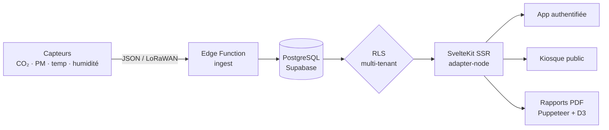
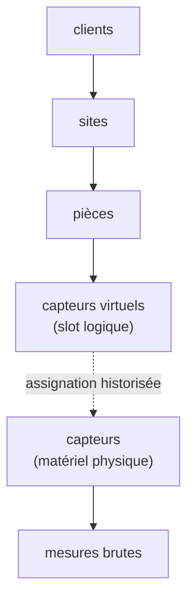
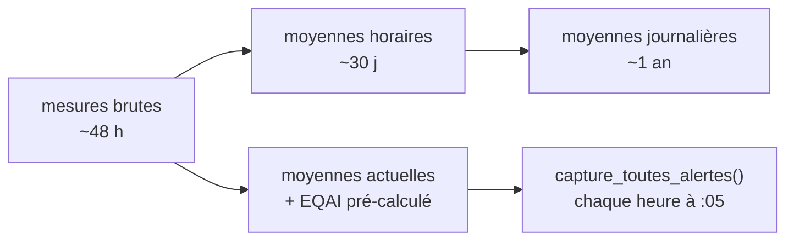
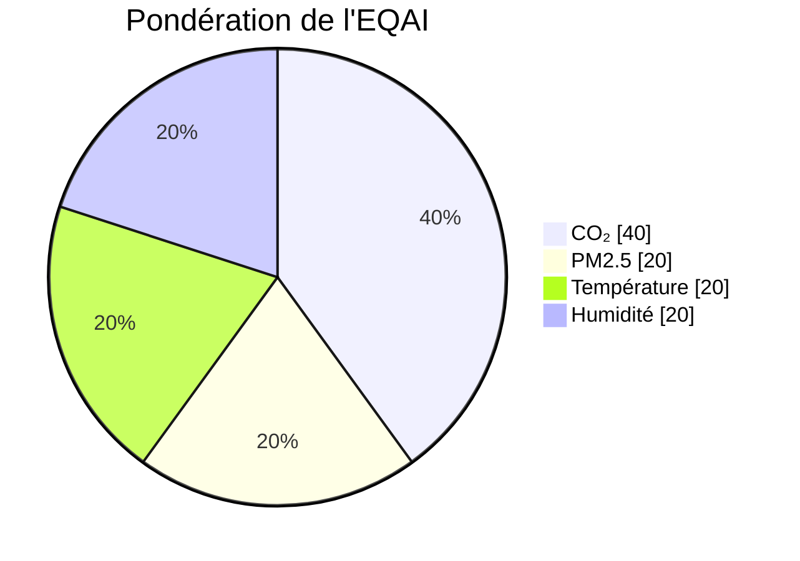

# SensiAir : du capteur LoRaWAN au PDF réglementaire

J'ai construit SensiAir parce que la plupart des outils « qualité de l'air » que je croisais s'arrêtaient à une jauge verte et un graphe de CO₂. Je voulais aller jusqu'au bout de la chaîne : du capteur physique posé dans une salle de classe jusqu'au rapport PDF qu'un directeur peut présenter à un inspecteur. Une plateforme SaaS multi-tenant, avec un mode kiosque pour le hall d'accueil et une console d'admin qui surveille sa propre santé. Voici comment c'est foutu sous le capot, et pourquoi j'ai fait ces choix.

## le problème : l'air intérieur, et l'administratif qui va avec

On passe environ 90 % de notre temps à l'intérieur, et l'air qu'on y respire est souvent plus chargé que celui de la rue : CO₂ qui grimpe dans une salle mal ventilée, particules fines, composés organiques volatils. En France, ce n'est plus qu'une affaire de confort. Les établissements recevant du public (écoles, crèches, collèges) ont une obligation de surveillance, avec une évaluation annuelle des moyens d'aération encadrée par le Cerema.

Mesurer, c'est une chose. Le prouver à un inspecteur en est une autre. C'est le point que je voulais traiter de bout en bout : ne pas m'arrêter à la donnée, mais produire le document qui la rend opposable.

## le tour du produit en cinq minutes

Côté utilisateur, l'application authentifiée tourne autour de quelques pages denses :

- **Dashboard cartographique.** Tous les sites d'un client sur une carte, code couleur selon l'indice d'air, panneau latéral au clic, KPIs (indice moyen, uptime, tendance 7 jours, alertes actives). J'ai mis la carte Mapbox (~1,6 Mo) en chargement différé pour ne pas plomber le premier rendu.
- **Sites et pièces.** Inventaire détaillé, avec comparaison de l'air intérieur face aux conditions météo extérieures quand je connais les coordonnées du site.
- **Analytics.** Comparaison de trois pièces en parallèle, heatmaps horaires, distributions, radar de scores, stats min/max/moyenne/écart-type. L'onglet d'analyse approfondie est chargé en différé lui aussi.
- **Alertes.** Quatre types distincts (dépassement de seuil, capteur hors ligne, capteur en erreur, emplacement vide), deux niveaux de sévérité, historique avec durée et notes de résolution, filtrage fin et export CSV.
- **Kiosque public.** Une route sans authentification, pensée pour un écran d'accueil : jauge animée de l'indice, illustration du bâtiment colorée pièce par pièce, rafraîchissement toutes les 30 secondes.
- **Cerema / ERP.** Un module à part entière : campagnes par type d'établissement, questionnaire réglementaire, autodiagnostic appuyé sur les données capteurs, plan d'actions, validation signée et lien de partage public du rapport.
- **Rapports.** Génération de PDF (standard ou détaillé), avec en option une analyse rédigée par IA, et un export CSV par pièce, site ou capteur.

Et derrière, une console super-admin qui n'a rien d'un gadget : monitoring des requêtes d'ingestion, santé de la base et des jobs CRON, journal d'audit, suivi de la consommation des API externes et des quotas par client.

## la stack : récente, et assumée

Je n'ai pas fait dans la demi-mesure sur les outils. Le projet est sur du **SvelteKit 2.47 avec Svelte 5.41**, runes comprises (`$state`, `$derived`, `$props`, `$effect`), servi en SSR via l'adapter Node, buildé avec Vite 7. L'UI s'appuie sur **Tailwind CSS 4** et une bibliothèque de composants maison basée sur bits-ui (façon shadcn-svelte), avec lucide pour les icônes.

La donnée vit dans **Supabase** (PostgreSQL + Auth + Row Level Security), accédée via `@supabase/supabase-js` et `@supabase/ssr`. Je régénère les types TypeScript depuis le schéma réel de la base, ce qui m'évite la dérive entre le SQL et le front. Les graphes sont rendus côté client avec LayerChart (un wrapper D3 pour Svelte) et côté serveur directement avec D3 pour les PDF. L'i18n passe par **Paraglide** : compilé à la build, zéro surcoût au runtime, FR et EN. Sentry surveille les erreurs, Zod valide les entrées.

L'ordre de traitement des requêtes, j'y tiens. Mon `hooks.server.ts` enchaîne cinq étages : Sentry, init de la session Supabase, contrôle d'authentification et redirection selon le rôle, en-têtes de sécurité (HSTS, CSP, X-Frame-Options), puis en-têtes de cache différenciés par route (le kiosque peut être mis en cache plus longtemps que le dashboard). Du middleware classique, mais explicite et ordonné.

Pour donner une idée de la masse : environ 130 000 lignes dans `src/`, 264 composants Svelte, 62 routes, 42 migrations SQL, 20 tables et 5 vues. Ce n'est pas un prototype de week-end.

## le modèle de données : isolé par conception

Tout est rangé dans une hiérarchie stricte, et toute l'isolation entre clients repose sur la Row Level Security de PostgreSQL. Un utilisateur ne voit que les données de son `client_id`, sans que j'écrive une seule clause `WHERE` à la main dans les requêtes : la base filtre. Les super-admins basculent d'un client à l'autre via un paramètre d'URL, et utilisent un client `service_role` pour les vues d'administration qui doivent traverser la frontière des tenants.

La décision dont je suis le plus content se cache dans ce diagramme : la séparation entre **capteur virtuel** et **capteur physique**. Le capteur virtuel est un emplacement logique, stable dans le temps, rattaché à une pièce. Le capteur physique, lui, est du matériel qui tombe en panne, se remplace, se recalibre. En historisant les assignations entre les deux, je peux changer un boîtier défectueux sans casser la continuité des séries de mesures ni perdre l'historique de la pièce. C'est typiquement le genre de choix qui vient de mon métier d'origine : sur le terrain, le matériel bouge, et le modèle de données doit l'absorber.

## l'ingestion et le pipeline : du brut au pré-calculé

Les capteurs envoient leurs mesures à une Edge Function Supabase (`/functions/v1/ingest`), qui accepte deux formats : mon format natif SensiAir et celui de The Things Stack pour le LoRaWAN. L'authentification se fait par clé API (préfixe `sak_`), avec rate limiting et journalisation fine de chaque requête (`api_ingest_logs` : device, code de statut, catégorie d'erreur, latence). C'est cette table qui alimente toute la page de monitoring d'ingestion côté admin.

Plutôt que de faire des `GROUP BY` sur des millions de lignes brutes à chaque affichage, je pré-agrège par étages successifs, avec des CRON PostgreSQL :

Conséquence pratique : l'indice, son libellé et sa couleur sont déjà calculés et stockés au moment où l'utilisateur ouvre une page. La lecture est en O(1). La rétention décroît avec la granularité (brut quelques jours, horaire un mois, journalier un an), ce qui garde la base légère sans perdre la tendance longue.

## l'EQAI : un indice composite, et inversé

Au centre, l'**EQAI** (European Quality Air Index), noté de 0 à 100, avec une convention qui surprend au premier abord : **plus bas est meilleur**. 0 c'est excellent, 100 c'est mauvais, l'inverse des indices type EPA. J'ai ajusté toute la logique d'affichage en conséquence, sur cinq paliers de couleur (vert, bleu, jaune, orange, rouge).

Il est composite, calculé par une fonction PostgreSQL à partir de quatre métriques pondérées :

J'ai mis le CO₂ au poids le plus lourd parce que ma cible principale, c'est la ventilation des salles occupées. Les alertes s'appuient sur des seuils stockés en JSONB par client (`seuils_clients`), avec des référentiels pré-configurés réutilisables. Quand on modifie les seuils, je rappelle la fonction de capture immédiatement pour un recalcul instantané, plutôt que d'attendre le passage horaire.

## les rapports : là où ça devient sérieux

Générer un PDF correct côté serveur, en environnement serverless, ce n'est pas trivial, et c'est la partie qui m'a coûté le plus. J'ai assemblé une chaîne complète : D3 produit des SVG (courbes, heatmaps, jauges, radars de conformité), un DOM headless les rend, Puppeteer avec un Chromium allégé (`@sparticuz/chromium`) capture, et pdf-lib assemble le document final. Détection automatique de l'environnement (Vercel, Lambda) pour basculer en mode serverless.

Le contenu va de la synthèse exécutive à l'inventaire du parc, en passant par les résultats par site et la comparaison intérieur/extérieur. En option, un fournisseur d'IA (configurable, avec un repli `mock` si aucune clé n'est fournie) rédige analyses et recommandations. Et pour les ERP, le rapport Cerema suit le cadre réglementaire (Art. R.221-30 à 37), avec validation signée et lien de partage public.

C'est cette partie qui transforme un joli dashboard en outil que quelqu'un paie pour utiliser : il ne montre pas seulement que l'air est bon, il fabrique la preuve à archiver.

## ce que je retiens

Ce qui compte pour moi dans SensiAir, ce n'est pas une techno isolée, c'est la cohérence d'avoir assumé toute la chaîne. Le découplage capteur virtuel / physique anticipe la vie réelle du matériel, parce que je viens de l'électronique et que je sais qu'un capteur, ça lâche. Le pré-calcul des agrégats traite la performance comme une décision de schéma, pas comme un patch tardif. Et le module Cerema ancre le tout dans un besoin concret et payant plutôt que dans la démo.

La suite est déjà dans le code : notifications push et SMS, 2FA, rapports email automatisés. L'histoire n'est pas finie.
