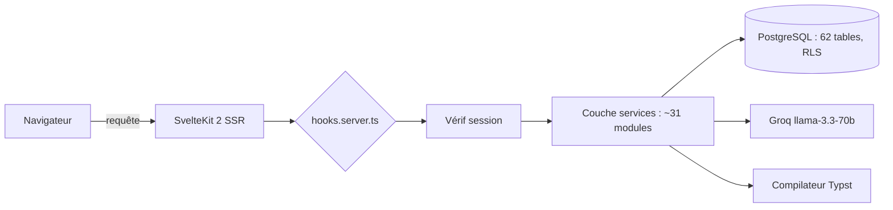
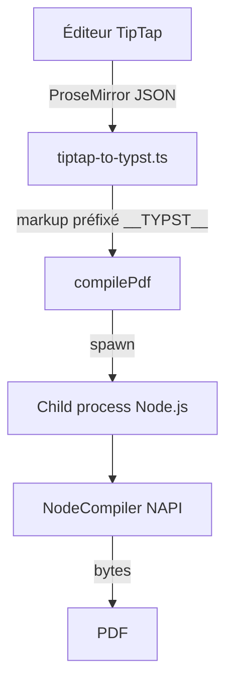

# Tempo : un SaaS de productivité d'équipe, taillé par un ingénieur

> Tempo regroupe tâches, projets, réunions et documents dans une seule app SvelteKit. Sous le capot : Supabase et ses 62 tables, un générateur PDF Typst maison, et de l'IA Groq cadrée par des quotas. Visite guidée d'un projet solo qui sent l'atelier d'ingénieur.

Il y a deux familles d'outils de productivité. Ceux qui empilent les fonctionnalités jusqu'à devenir illisibles, et ceux qui en font trop peu pour mériter qu'on quitte son tableur. Tempo cherche la ligne de crête entre les deux, et le plus intéressant n'est pas la promesse marketing : c'est la manière dont c'est construit. On a affaire à un SaaS porté par un seul développeur, avec une discipline d'ingénieur sur chaque couche. Version actuelle en production : 0.36.1.

## le pitch

Le constat de départ est banal, et c'est précisément ce qui le rend crédible : une équipe jongle entre un gestionnaire de tâches, un outil de notes de réunion, un drive pour les documents, et un éditeur séparé dès qu'il faut sortir un PDF propre. Tempo réunit tout ça dans une interface unique, organisée autour d'espaces de travail multi-locataires.

Concrètement, un utilisateur ouvre Tempo et trouve son tableau de bord, ses tâches sous cinq formes de vue (liste, kanban, calendrier, timeline, historique), ses projets avec indicateurs de santé, ses réunions, et un module documents qui va du compte-rendu structuré jusqu'au CV exporté en PDF. Le tout sous un thème qu'il a choisi lui-même, persistant sur tous ses appareils.

Le modèle économique est posé : un plan Standard gratuit après 14 jours d'essai, un plan Pro à 19 € par mois (190 € à l'année), et de l'Enterprise sur devis avec un système de licences distribuées par espace.

## le tour du propriétaire

Les modules cœur ne réinventent pas la roue, ils la montent bien.

Les **tâches** acceptent sous-tâches, priorités, deadlines, tags colorés et estimation de charge. L'estimation se fait en demi-journées (une demi-journée = 4 h), un choix de granularité qui colle au réel d'un planning d'équipe bien mieux que des heures fictives. Cette unité irrigue tout le reste : le dashboard calcule une prévision de charge sur les cinq prochains jours ouvrés en répartissant chaque tâche sur sa fenêtre created_at → deadline, et bascule la charge des tâches en retard sur aujourd'hui. Pas de pic d'urgence artificiel, une vraie courbe lissée.

Les **réunions** ne stockent pas que des notes : chaque item est typé (note, décision, action, bloqueur, bug, idée), et un item « action » se convertit en tâche d'un clic. Les **documents** couvrent un spectre large grâce à un système de sections (texte, checklist, code, table, inventaire, bilan auto-calculé) avec réorganisation par glisser-déposer. Le module **CV et lettres** réutilise cette infrastructure : éditeur en double panneau avec aperçu PDF en direct, quatre gabarits, polices et taille ajustables.

Au-dessus, un **panneau admin** réservé au super-administrateur agrège MRR, utilisateurs actifs quotidiens, distribution des plans, et un journal d'audit complet des actions sensibles.

## sous le capot

C'est ici que le projet devient parlant pour un développeur. La stack est récente sans être instable : Svelte 5 avec les runes (`$state`, `$derived`, `$props`), SvelteKit 2, Tailwind CSS v4, shadcn-svelte par-dessus bits-ui, validation Zod, le tout en TypeScript strict. Le backend repose entièrement sur Supabase : PostgreSQL, auth, storage et realtime.

La base compte 62 tables et 89 migrations SQL versionnées, chacune protégée par du Row Level Security : l'isolation entre espaces n'est pas vérifiée par du code applicatif fragile, elle est garantie au niveau de la base via `auth.uid()` et `espace_id`. La logique métier vit dans une trentaine de services à fonctions pures, qui prennent le client Supabase en premier paramètre et renvoient toujours la même forme `{ success, data?, error? }`. Ordre de grandeur du codebase : environ 344 composants Svelte et 186 fichiers TypeScript.

L'authentification passe par une chaîne de middleware courte et lisible :

## la signature maison : du PDF avec Typst

La plupart des SaaS génèrent leurs PDF avec Puppeteer (donc un Chromium headless à nourrir) ou avec une lib JavaScript à la typographie pauvre. Tempo a fait un autre pari : Typst, le moteur de composition moderne héritier de l'esprit TeX, appelé via `@myriaddreamin/typst-ts-node-compiler`. Vingt et un gabarits `.typ` couvrent CV, lettres, mémos, procès-verbaux, attestations et procédures.

Le détail qui sépare le bricoleur de l'ingénieur est le suivant : le compilateur NAPI plante en SSR Vite sur les chemins accentués (l'erreur « os error 123 » sous Windows). Plutôt que de tordre la configuration Vite, le compilateur est isolé dans un child process Node.js qui charge le NAPI en CommonJS, hors transpilation, avec un espace de travail dans `os.tmpdir()` pour échapper aux accents. Trente lignes de contournement assumé, au lieu d'un bug qui ressurgit à chaque build.

Le pont entre l'éditeur et Typst mérite aussi un mot. Le richtext saisi dans TipTap arrive en JSON ProseMirror, converti en markup Typst par `tiptap-to-typst.ts`. Le résultat est préfixé par un marqueur `__TYPST__` : c'est le signal qui dit au gabarit d'appeler `eval()` en mode markup plutôt que de traiter le contenu comme une chaîne brute. Les métadonnées restent du JSON souple côté Node, Typst fait le rendu typographique. Propre.

## de l'IA, mais cadrée

L'IA de Tempo n'est pas un chatbot collé dans un coin. Six endpoints ciblés s'appuient sur Groq et son modèle llama-3.3-70b : reformulation de texte, correction orthographique, extraction de tâches depuis une description en langage naturel (avec détection des sous-tâches), résumé hebdomadaire pour le dashboard. Chaque usage est utile à un endroit précis du produit.

Surtout, c'est borné. Un service de quotas compte les appels du jour et les compare au plan : 5 par jour en gratuit, 50 en Pro, illimité en Enterprise. Chaque appel émet un `platform_event`, ce qui donne un audit d'usage gratuit et alimente les stats admin. Le dépassement de quota est lui-même journalisé. Une variable `GROQ_DEV_MODE` débloque tout en développement. C'est la manière dont on intègre de l'IA quand on doit en payer la facture.

## les détails qui trahissent l'ingénieur

Quelques choix en disent long sur la rigueur du projet. Le système de thèmes propose cinq bases (Slate, Gray, Sand, Ocean, Mauve) et neuf accents en couleurs OKLCH, avec un script anti-FOUC inline dans `app.html` qui lit les cookies avant le premier rendu : aucun flash de thème par défaut au chargement. Le tableau kanban regroupe ses tâches via un `$derived.by`, sans souscription manuelle. Les tests tournent sur deux environnements Vitest, Node par défaut et un vrai Chromium via Playwright pour les fichiers `.svelte.test.ts`. Et le projet embarque ses endpoints RGPD (export et suppression différée à 30 jours), pas comme une option ajoutée plus tard mais comme une route à part entière.

## du code à la prod

Pas d'hébergement managé hors de prix ici. Tempo se déploie sur un VPS Ubuntu derrière Nginx, servi par `adapter-node` et supervisé par PM2, SSL via Let's Encrypt. Le pipeline est tenu par GitHub Actions : un push sur `main` déclenche un SSH vers le serveur, `git pull`, `npm ci`, build, puis redémarrage PM2. Environ trois minutes du commit à la mise en ligne.

Ce qui frappe, au bout du compte, c'est la cohérence. Chaque couche a été choisie pour une raison défendable, et les compromis sont assumés au lieu d'être cachés sous le tapis. Tempo n'est pas un projet qui cherche à impressionner par sa liste de fonctionnalités : c'est un projet qui tient debout parce que quelqu'un a réfléchi à chaque jointure. Et ça, pour un produit solo en production, c'est rare.
